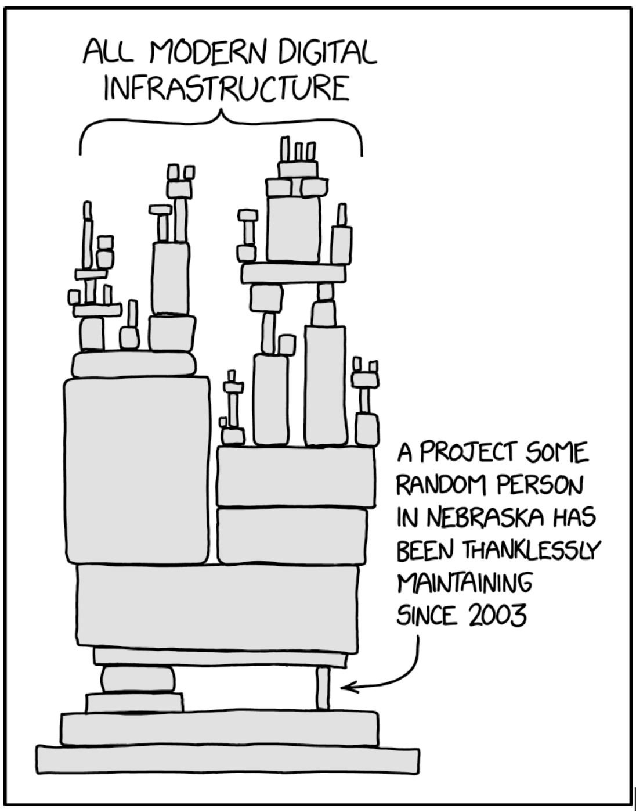
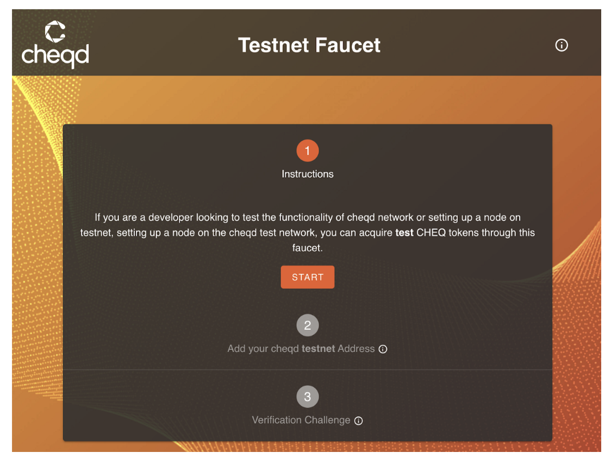
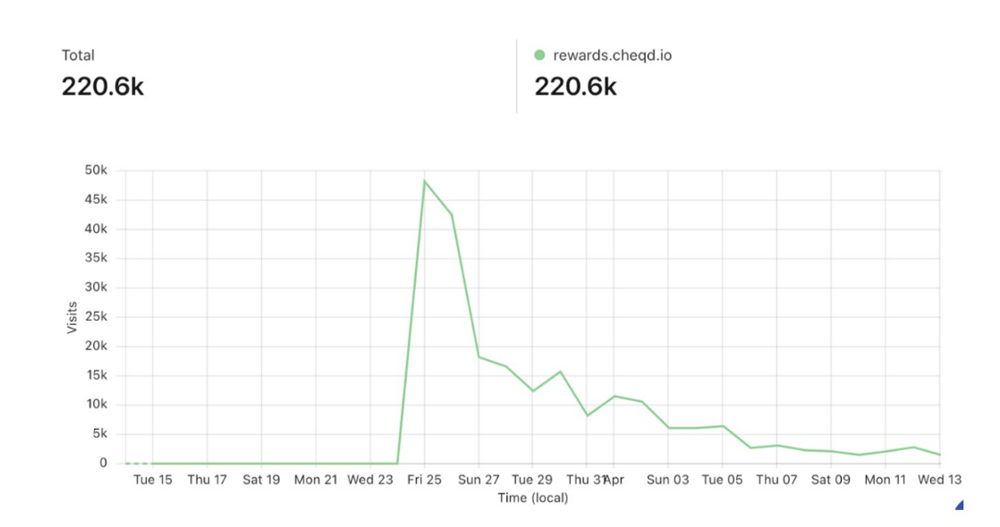
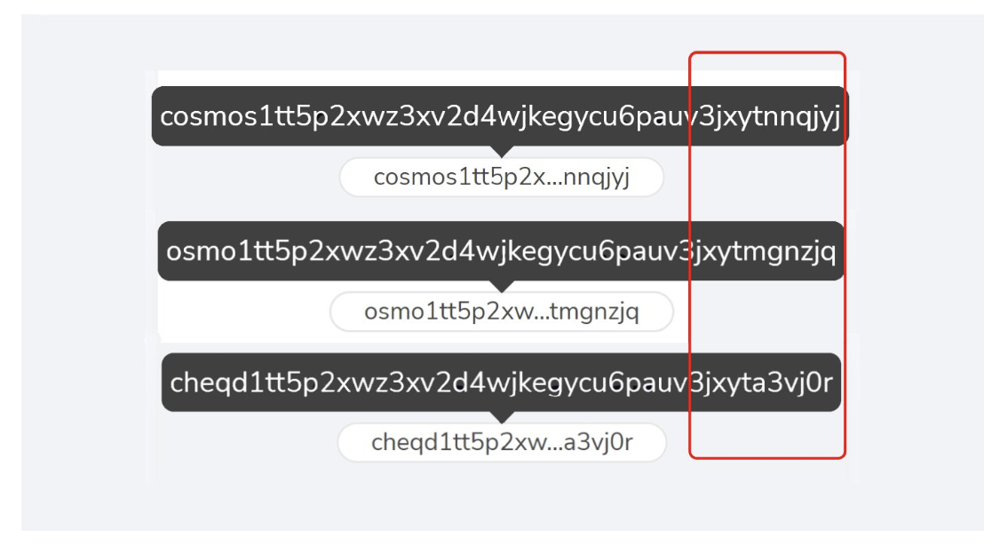

# 🌍 Infrastructure

## Context

As strong proponents for [open source software](https://opensource.dev/), over the past month the [cheqd](https://www.cheqd.io/) Engineering & Product team has spent a lot of effort polishing and open-sourcing products we’ve been developing for decentralised identity and Cosmos SDK framework. Some of these tools are core to delivering [our product roadmap vision](https://blog.cheqd.io/cheqds-product-vision-for-2022-6a92e8e4d296), while others are tools we built for internal usage and believe will be valuable for developers outside of our company.

Most of the [Cosmos SDK blockchain framework](https://cosmos.network/), as well as [self-sovereign identity (SSI)](https://learn.cheqd.io/overview/introduction-to-decentralised-identity) code is built by community-led efforts where developers open source and make their code available for free. Or at least, that’s how it’s supposed to work. In practice, what quite often happens, unfortunately, is that very few companies or developers contribute code “upstream” or make them available to others leading to the “[one random person in Nebraska” problem](https://xkcd.com/2347/).

Source: [xkcd #2437 "Dependency"](https://xkcd.com/2347/)

Our intention is to enable others to benefit from our work. For each tool that we are releasing under an open source license ([Apache 2.0](https://snyk.io/learn/apache-license/)), we explain what the **unique value proposition is**, and **which audiences could benefit from the work** we have done.

## Contents

The tools we are open-sourcing, explained on this page include:

1. Streamlining node setup and management with Infrastructure-as-code
2. Automated distribution of CHEQ test tokens with our Testnet Faucet
3. Frontend/backend for running Cosmos SDK airdrops
4. Cosmos Cross chain address convertor CLI

### 1. Streamlining node setup and management with Infrastructure-as-code

> 🛠️ **Github repository**: [cheqd/infra](https://github.com/cheqd/infra)

Over the past months we’ve been implementing various tools to improve performance, speed up node setup and help to reduce manual effort for our team and external developers as much as possible. We wanted to make installing and running cheqd nodes easy. Therefore, our automation allows people to configure secure, out-of-the-box configurations efficiently and at a low cost.

### Terraform: Infra-as-code

We have started using [HashiCorp’s Terraform](https://www.terraform.io/) to define consistent and automated workflows — in order to improve efficiency and streamline the process of setting up a node on cheqd. Terraform is a form of Infra-as-code which is essentially the managing and provisioning of infrastructure through code instead of through manual processes. You can think of it like dominos — one click of a button can result in a whole series of outcomes.

This automation gives prospective network Validators the choice of whether they want to just install a validator node ([using our install instructions](https://docs.cheqd.io/node/getting-started/setup-and-configure)), or whether they want to set up a sentry+validator architecture for more security.

### Terragrunt: Infra-as-code

[Terragrunt](https://terragrunt.gruntwork.io/) works hand-in-hand with Terraform, making code more modular, reducing repetition and facilitating different configurations of code for different use cases. You can plug in config information like CPU, RAM, Static IPs, Storage, etc., which speed things up whilst making the code more modular and reusable.

Through the use of Terragrunt, we are also able to extend our infrastructure to a full suite of supported cloud providers. This is important since our infrastructure code only works directly with [Hetzner](https://www.google.com/search?q=hetzner\&oq=hetzner\&aqs=chrome..69i57.3321j0j1\&sourceid=chrome\&ie=UTF-8) and [DigitalOcean](https://www.digitalocean.com/) cloud providers (for their good balance of cost vs performance). We did, however, recognise that many people use [AWS](https://aws.amazon.com/) or [Azure](https://azure.microsoft.com/en-au/). Terragrunt therefore, performs the role of a wrapper to make our infrastructure available in Hetzner and DigitalOcean, as well as making it easier to utilise with AWS or Azure.

### Ansible: Infra-as-code

[Ansible](https://www.ansible.com/) allows node operators to update software on their nodes, carry out configuration changes etc, during the first install and subsequent maintenance. In a similar way to Terragrunt, Ansible code can also act as a wrapper, converting the code established via Terragrunt and Terraform into more cross-compatible formats.

Using Ansible, the same configurations created for setting up nodes on cheqd could be packaged in a format which could be consumed by other Cosmos networks. Therefore, this could have a knock-on effect for benefiting the entire Cosmos ecosystem for running sentry+validator infrastructure.

### DataDog: Monitoring

[DataDog](https://www.datadoghq.com/) is a tool that provides monitoring of servers, databases, tools, and services, through a SaaS-based data analytics platform. You can think of it like a task manager on your laptop. Using DataDog we keep an eye on metrics from Tendermint (e.g. if a validator double signs a transaction) and the (e.g. transactions / day).

This is valuable to ensure the network runs smoothly & any security vulnerabilities/issues that may impact consensus are quickly resolved.

### Cloudflare Teams: Role Management (SSH)

When managing a network it’s important that those building it can gain access when they need it. For this we’ve been using [Cloudflare Teams (AKA Cloudflare Zero Trust)](https://www.cloudflare.com/en-gb/products/zero-trust/) to SSH into one of our nodes.

SSH ([Secure Shell](https://www.ssh.com/academy/ssh)) is a communication protocol that enables two computers to communicate by providing password or public-key based authentication and encrypted connections between two network endpoints

This work is important because other Cosmos networks can reuse the role management package to reduce the time spent on configuring their own role management processes for SSH.

HashiCorp Vault: Secret Sharing

Sharing secrets in a secure fashion is vital — for this we’ve [HashiCorp Vault](https://www.vaultproject.io/) which offers a script that copies private keys and node keys over to a vault. You can think of this like [LastPass](https://twitter.com/LastPass) or [1Password](https://1password.com/) for network secrets (e.g. private keys). This way, if for example a node is accidentally deleted and the private key is deleted for a validator, it’s easy to restore it.

This is hugely valuable for Validator nodes, who may want to add an extra layer of security to the process of backing up private keys and sharing keys between persons internally. Moreover, through using HashiCorp Vault, we hope to reduce the amount of risk teams may incur of losing their private keys and thus, losing the ability to properly manage their nodes.

## 2. Automated distribution of CHEQ test tokens with our Testnet Faucet

> 🛠️ **Github repository**: [cheqd/faucet-ui](https://github.com/cheqd/faucet-ui)

The [cheqd testnet faucet](https://testnet-faucet.cheqd.io/) is a self-serve site that allows app developers and node operators who want to try out our identity functionality or node operations to request test CHEQ tokens, without having to spend money to acquire “real” CHEQ tokens on mainnet.

We built this using [Cloudflare Pages](https://developers.cloudflare.com/pages/) as it provides a fast way to create serverless applications which are able to scale up and down dynamically depending on traffic, especially for something such as a testnet faucet which may not receive consistent levels of traffic. The backend for this faucet works using an existing [CosmJS faucet app](https://github.com/cosmos/cosmjs/tree/main/packages/faucet) to handle requests, run using a Digital Ocean app wrapped in a Dockerfile.

_Figure: cheqd_ [_testnet faucet_](https://testnet-faucet.cheqd.io/)

**Why is this valuable?**

This solution:

1. Helps to keep the team focused on building, as no longer do we need to dedicate time for manually responding to requests for tokens.
2. Creates a far more cost effective way of handling tesnet token distributions
3. Can be utilised by developers to test cheqd functionality far more efficiently
4. Can be used by other Cosmos projects to reduce operational overheads and reduce headaches around distributing testnet tokens

## 3. Frontend/backend for running Cosmos SDK airdrops

> 🛠️ **Github repository**: [cheqd/airdrop-ui](https://github.com/cheqd/airdrop-ui) (frontend), [cheqd/airdrop-distribution](https://github.com/cheqd/airdrop-distribution)(backend)

The airdrop tools, used for our [community airdrop rewards](https://github.com/cheqd/airdrop-ui) site, are split into two repos; one for managing the actual distribution of airdrop rewards to wallets, and another for the frontend itself to handle claims.

In terms of the frontend, we learnt that airdrop reward sites need to be more resilient to traffic spikes than most websites because, when announced, community members will tend to flock to the site to claim their rewards generating a large spike in traffic, followed by a period of much lower traffic.

This type of traffic pattern can make prepping the server to host airdrop claim websites particularly difficult. For example, many projects will choose to purchase a large server capacity to prevent server lag, whilst others may simply become overwhelmed with the traffic.

To manage this, the frontend site was developed to work with [Cloudflare Workers](https://developers.cloudflare.com/workers/), a serverless and highly-scalable platform so that the airdrop reward site could handle these spikes in demand.

On the backend we also needed to build something that could manage a surge in demand whilst providing a highly scalable and fast way of completing mass distributions. Initially our implementation struggled with the number of claims resulting in an excessive wait to receive rewards in the claimant’s wallet. To improve this we used 2 separate CosmJS-based [Cloudflare Workers](https://developers.cloudflare.com/workers/) scripts; one which lined up claims in 3 separate queues (or more if we wanted to scale further), and a second distributor script that is instantiated dependent on the number of queues (i.e. 3 queues would require 3 distribution workers).

There is no hiding that we ran into some hiccups, in part due to our Cloudflare Worker approach, during our [Cosmos Community Mission 2 Airdrop](https://www.cheqd.io/blog/cosmos-community-mission-2). We have documented all of the issues we ran into during our airdrop and the lessons learnt in our [airdrop takeaway blog post](https://blog.cheqd.io/what-we-learned-from-the-cheq-community-2f00952095c2).

What is important to explain is that:

1. The reward site using[Cloudflare Workers](https://developers.cloudflare.com/workers/) scaled very well in practice, with no hiccups;
2. We had problems with the way we collated data, but the fundamental Cloudflare Workers infrastructure we ended up with, after having to refactor for our initial mistakes, is battle tested, highly efficient and resilient.

**Why is this valuable?**

Any project using the CosmosSDK and looking to carry out an airdrop or community rewards program can now use our Open Sourced frontend UI and Distribution repository to ensure a smooth and efficient process for the community, without any hiccups in the server capacity or distribution mechanics.

We would much rather other projects do not make the same mistakes as we did when we initially started our airdrop process. What we have come away with, in terms of infrastructure and lessons learned, should be an example of the do’s and the not-to-do’s when carrying out a Cosmos based airdrop.

## 4. Cosmos Cross chain address convertor CLI

> 🛠️ **Github repository**: [cheqd/cosmjs-cli-converter](https://github.com/cheqd/cosmjs-cli-converter)

There is an assumption in the CosmosEcosystem that wallet addresses across different chains, such as, Cosmos (ATOM), Osmosis (OSMO) and cheqd (CHEQ) are all identical. This is because they all look very similar. However, each chain’s wallet address is actually unique.

Interestingly, each network’s wallet address can be derived using a common derivation path from the Cosmos Hub wallet address. Using one derivation path #BIP44 means that users that use one secret recovery phrase and core account to interact with multiple networks.

Our cross-chain address convertor is able to automate the derivation of any chain address from one Cosmos address to another. We’ve seen some examples of this previously, but they are mostly designed to do one-off conversions in a browser rather than large-scale batch conversions. Emphatically, our converter could do 200k+ addresses in a few minutes. Doing this using any existing CLI tools or shell scripts can take hours.

## **Why is this valuable?**

This is valuable since it can automate airdrops or distributions to any account, just from a Cosmos Hub address in bulk, making data calculations far more efficient.

For new chains in the Cosmos Ecosystem, this makes it much easier for the core team and[Cosmonauts](https://twitter.com/hashtag/cosmonauts?src=hashtag\_click) to discover and utilise their account addresses and carry out distributions.
