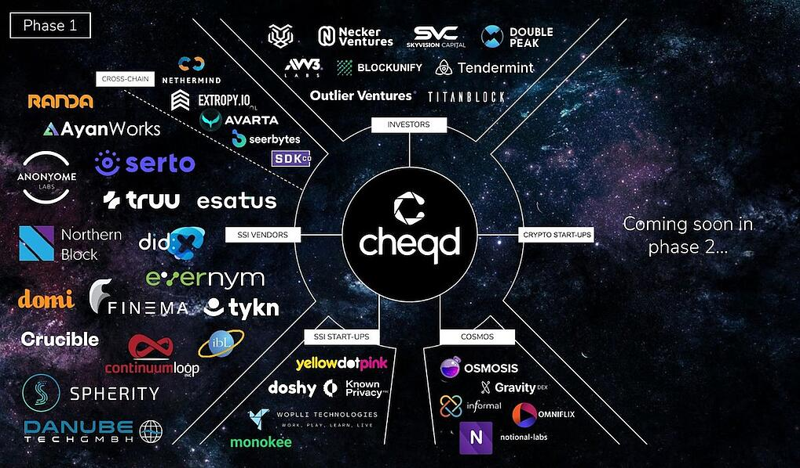

# 1⃣ 2021 Changelog

November - Mainnet Release (v0.3.1)

### Context

In November we released our mainnet with the support of our wide range of partners. 

cheqd was always meant to be designed with decentralised identity at its core. As such, this release is where we implemented our foundational identity functionality.

You'll find out more depth about this release in our [release blog available here.  ](https://www.cheqd.io/blog/welcome-to-a-new-era-for-decentralised-identity)

### Changelog

* The most important new features of mainnet are:
  * Added functionality for decentralised identity, specifically Decentralised Identifiers (DIDs), [utilising the new cheqd DID method](https://www.cheqd.io/blog/welcome-to-a-new-era-for-decentralised-identity)
  * [Amended the genesis parameters](https://www.cheqd.io/blog/welcome-to-a-new-era-for-decentralised-identity)
  * [Integration with Keplr, OmniFlix and Block Explorer](https://www.cheqd.io/blog/welcome-to-a-new-era-for-decentralised-identity)

### Full changelog

[https://github.com/cheqd/cheqd-node/releases/tag/v0.3.1](https://github.com/cheqd/cheqd-node/releases/tag/v0.3.1)

October - Testnet Release (v0.2.7)

### Context

As we come towards our mainnet release, the purpose of this release is to test out the range of functionality we plan on releasing onto the cheqd mainnet.

### Changelog

**Key items:**

* Bump cosmos sdk to v0.44.3
* Swap the context field to top of the DIDDoc, before ID
* Add identity specific tests
* Add DIDDoc to Identity ADR
* Get rid of symlinks and add ability to change HOME directory by

### Full changelog

[https://github.com/cheqd/cheqd-node/releases/tag/v0.2.7](https://github.com/cheqd/cheqd-node/releases/tag/v0.2.7)

August - Testnet

### Context

In this release we __ [_open-sourced our code_](https://github.com/cheqd) _for a token-incentivised SSI network built on the_ [_Cosmos blockchain framework_](https://cosmos.network/)_. We’re expanding beyond private beta to a public testnet, with plans for publishing further details about tokenomics and governance in future releases._

Our testnet launch in July 2021 gave us valuable feedback from our early adopters in being able to refine where our engineering teams should focus on. While we initially planned to release a Cosmos-based Decentralized Identifiers (DIDs) specification for August, the feedback we received was to focus on making the installation and upgrade processes easier.

We’ve therefore worked towards making installation packages and releases (along with documentation) available in the following formats:

1. [**Debian (.deb) package installer**](https://github.com/cheqd/cheqd-node/releases), targeting [Ubuntu 20.04 LTS](http://www.releases.ubuntu.com/20.04/) (the Linux distribution most Hyperledger Indy node operators should be familiar with)
2. [**Docker containers**](https://github.com/orgs/cheqd/packages?repo\_name=cheqd-node), as a more platform-independent way of deploying the cheqd blockchain node software
3. [**Linux binary packages**](https://github.com/cheqd/cheqd-node/releases), as a baseline for other Linux distributions
4. Instructions on how to build any of the above from source.

We’re also exploring support for other platforms in the future, for example, a [Snap package](https://snapcraft.io/) for other Linux distributions.

One challenge with having a private beta was the logistical challenge of allowing prospective node operators to freely browse and decide to install the code at their own pace, rather than individually trying to coordinate access to the repositories.

### Changelog

* While it’s early days, the [cheqd Cosmos Command Line Interface (CLI) user guide](https://github.com/cheqd/cheqd-node) we’ve started building defines what can be done on our testnet. We started this by asking the following:
* **Basic Cosmos node setup and the “cheq” token**
  * Creating, managing, and configuring accounts and keys on a cheqd Cosmos node. These are set up steps that new node operators need to do to get started.
  * Our public-permissionless model is based on [proof-of-stake](https://en.wikipedia.org/wiki/Proof\_of\_stake), so we walk through how to stake and participate in network consensus.
  * Basic token functionality for [holding and transferring our tokens, called “**cheq**”](https://blog.cheqd.io/announcing-cheqds-testnet-for-a-new-incentivised-decentralised-identity-4f625ea77076), to other accounts on the network.
*   **Basic decentralised identity primitives**

    * Writing Decentralized Identifiers (DIDs) entries on a ledger paying for DID writes on the cheqd testnet using testnet tokens. As our CEO, Fraser Edwards, and Javed Khattak (our CFO) described in this blog post [why self-sovereign identity needs a token](https://blog.cheqd.io/why-self-sovereign-identity-needs-a-token-46e43dada01d); we want to [enable new business models for digital identity](https://blog.cheqd.io/the-business-models-of-identity-bb3336773727).
    * [NYM is the term used by Hyperledger Indy](https://hyperledger-indy.readthedocs.io/projects/node/en/latest/transactions.html#nym) for Decentralized Identifiers (DIDs) that are created on ledger. For the sake of explaining with similar concepts as current Hyperledger Indy implementations, on our testnet transactions to add a DID to the ledger are called NYM transactions. Future releases of our software are likely to replace the NYM terminology with DID for better understanding.

### Full changelog

July - Beta product &#x26; Testnet

### Context

Our goal was to have a persistent network accessible to developers to build apps against. This was our target to get up and running with external partners, and we’re glad to have our launch partners onboard.

The genesis ceremony for the **cheqd** testnet was carried out on **Wednesday, 21 July 2021**. Prior to the genesis ceremony, we had asked all our launch partners to setup a node with a Cosmos **cheqd** node with the beta software code.

During the ceremony, we minted **1 billion cheq test tokens** as well as the genesis configuration required to connect up all the nodes into the testnet. We’d planned for the ceremony to take 1.5 hours, but as these things go, we ended up extending this to 2 hours as to fix teething issues during peer configuration.

The balance minted with cheq test tokens was distributed as follows:

1. **20% cheq test tokens distributed to the founding validators**: We wanted to model the fact that in real life, different validator nodes would have different amounts staked.
2. **80% cheq test tokens was set aside for future validators, treasury, and cold storage**: We distributed the majority of the tokens minted as set aside for future use.

The **cheqd** testnet currently involves **four Cosmos validator nodes**, one from each founding launch partner. The functionalities available at the moment allow anyone with access to the nodes to:

1. Create Cosmos accounts that can hold **cheq** test tokens
2. Create DIDs that can be written to the **cheqd** testnet, and pay for it with cheq test tokens
3. Automation to speed up basic testnet **cheqd** node deployment

We wanted to get this code early with external partners, so that we can start capturing feedback from potential real node operators in the future.

To make the process of distributing the 20% **cheq** test tokens among the founding validators randomised, an appointed representative from each of the founding validators [rolled three dice using DuckDuckGo](https://duckduckgo.com/?q=roll+three+dice\&t=newext\&atb=v269-1\&ia=answer). After multiple rounds of die rolls (and an impromptu guitar solo!) we ended up with this distribution:

1. **Outlier Ventures** at 9%
2. **cheqd** at 5%
3. **Evernym** at 4%
4. **DIDx** at 2%

As we open up the network to more validators, we’ll distribute more cheq test tokens on a randomised basis. We will be working in the background over the next few weeks to onboard additional validator nodes, initially as a manual process and then expanding it to make it public and open for anyone to join the network. We will continue working on tooling and services to make this process easier.

### Full changelog

