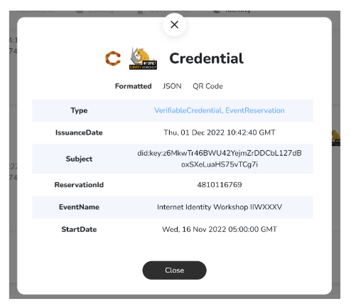

# Wallet demo v2 (1.3.0)

## Context

The cheqd demo identity wallet has been bumped to version 1.3.0.

We have been working hard over the last few months to improve the demo experience that we have hosted on [wallet.cheqd.io](https://wallet.cheqd.io/welcome). This was in part built out for Internet Identity Week #35 in November 2022.

## cheqd Wallet

**What's changed?**

### Importing QR codes to the wallet (IIW event ticket) and issuing credentials based on data within the QR code

Being able to upload existing QR codes to the cheqd wallet is a huge feature, since it allows users to upload things like tickets they have purchased, and convert the ticket into a Verifiable Credential.

This is a great way of demonstrating the power of Verifiable Credentials, since the validity of the ticket can be verified through cryptographic trust.



### Combining tickets with a social media proof

We have added the way to share and present multiple credentials together; including event tickets in combination with a credential you can get from authenticating with a social media platform. This is powerful because it can combine trust from multiple sources into one overarching QR-code proof, and importantly, this combined proof can be verified.

### Adding more social media auth0 providers

We have added the ability to authenticate with three different social media platforms: Twitter, Discord and GitHub. You can therefore receive Verifiable Credentials for being able to prove you can log in with these platforms.

### Using DID-Linked Resources in Credentials

We have been able to include DID-Linked Resources for schemas and logos into the core content of the Verifiable Credentials issued on the wallet interface. Below is an example of an image being pulled from the cheqd ledger which is included in a Verifiable Credential.

```bash
[https://resolver.cheqd.net/1.0/identifiers/did:cheqd:mainnet:c82f2b02-bdab-4dd7-b833-3e143745d612/resources/cb3f5f64-c138-4309-b9ea-8d658b0ae28e](https://resolver.cheqd.net/1.0/identifiers/did:cheqd:mainnet:c82f2b02-bdab-4dd7-b833-3e143745d612/resources/cb3f5f64-c138-4309-b9ea-8d658b0ae28e)
```

### Wallet changelog

* feat: Fix credential list by [@DaevMithram](https://github.com/DaevMithran) in[#127](https://github.com/cheqd/wallet/commit/54bd9ed69e2e2e6876c0a461f6978ac0768d462e)
* feat: Use on ledger resources by[@RossPower11](https://github.com/cheqd/wallet/commit/90e01d1d1dfbd968b38ec9b930edf2040d70a6c7)in [#125](https://github.com/cheqd/wallet/pull/125)
* feat: Social logos as on-ledger resources by [@jay-dee7](https://github.com/jay-dee7) in [#125](https://github.com/cheqd/wallet/pull/125)
* feat: Add support for multiple Auth0 providers by [@jay-dee7](https://github.com/jay-dee7) in [#115](https://github.com/cheqd/wallet/pull/115)
* feat: Issue IIW pass with eventId by [@DaevMithram](https://github.com/DaevMithran) in [#111](https://github.com/cheqd/wallet/pull/111)
* feat: export&import holder dids by [@DaevMithram](https://github.com/DaevMithran) in [#111](https://github.com/cheqd/wallet/pull/111)
* feat: Presentation support & IIW credential support by[@RossPower11](https://github.com/cheqd/wallet/commit/90e01d1d1dfbd968b38ec9b930edf2040d70a6c7) in[#104](https://github.com/cheqd/wallet/commit/7072ef812b95f790afd6905d56155ef2ee56d1d3)
* feat: Update formatted view by [@DaevMithram](https://github.com/DaevMithran) in[#104](https://github.com/cheqd/wallet/commit/7072ef812b95f790afd6905d56155ef2ee56d1d3)
* feat: Add verifyPresentation Support by [@DaevMithram](https://github.com/DaevMithran) in[#104](https://github.com/cheqd/wallet/commit/7072ef812b95f790afd6905d56155ef2ee56d1d3)
* feat: Add createPresentation method && VeramoSubjectId by [@DaevMithram](https://github.com/DaevMithran) in[#104](https://github.com/cheqd/wallet/commit/7072ef812b95f790afd6905d56155ef2ee56d1d3)
* feat: Add veramo presentation support by [@DaevMithram](https://github.com/DaevMithran) in[#104](https://github.com/cheqd/wallet/commit/7072ef812b95f790afd6905d56155ef2ee56d1d3)
* feat: Import credentials from PDFs by [@jay-dee7](https://github.com/jay-dee7) in[#104](https://github.com/cheqd/wallet/commit/7072ef812b95f790afd6905d56155ef2ee56d1d3)
* fix: Background and text color overlap on creds by [@jay-dee7](https://github.com/jay-dee7) in[#101](https://github.com/cheqd/wallet/commit/7072ef812b95f790afd6905d56155ef2ee56d1d3)
* fix: Remove undefined credentials by [@DaevMithram](https://github.com/DaevMithran) in [#127](https://github.com/cheqd/wallet/pull/127)
* fix: QR popup length by [@DaevMithram](https://github.com/DaevMithran) and [@ankurdotb](https://github.com/ankurdotb) in [#128](https://github.com/cheqd/wallet/pull/128)

## Secret box service using Cloudflare Workers

This is used to store credentials from the [wallet.cheqd.io](https://wallet.cheqd.io/) web app. This works by _only_ storing an encrypted copy of the credentials.

**What’s changed?**

* [General dependency and packages bumps](https://github.com/cheqd/secret-box-service/commits/main)

## Auth0 service

This package is to provide an OAuth connect via the Auth0 service for credentials in [wallet.cheqd.io](https://wallet.cheqd.io/) web app to enable users to authenticate with social media platforms.

**What’s changed?**

We set up this service as a Cloudflare Worker which means that it only runs an instance when a user clicks to connect their social media account. We improved the way that the service extracts data from Twitter, Discord and GitHub profiles.

* feat: Auto-deploy to Cloudflare Workers staging and production by [@ankurdotb](https://github.com/ankurdotb) in [#8](https://github.com/cheqd/auth0-service/commit/4b46ec26f1f677fbd6b27749fcc847475797d7fb)
* fix: Auth0 GitHub provider by [@jay-dee7](https://github.com/jay-dee7) and [@ankurdotb](https://github.com/ankurdotb) in [#29](https://github.com/cheqd/auth0-service/pull/29)
* fix: Extract name for Twitter and Discord separately by [@ankurdotb](https://github.com/ankurdotb) in[#28](https://github.com/cheqd/auth0-service/commit/3087320d7b79a16bd264dd926caac4768d95d0dc)
* fix: Discord user handling by [@jay-dee7](https://github.com/jay-dee7) and [@ankurdotb](https://github.com/ankurdotb) in [#27](https://github.com/cheqd/auth0-service/pull/27)
