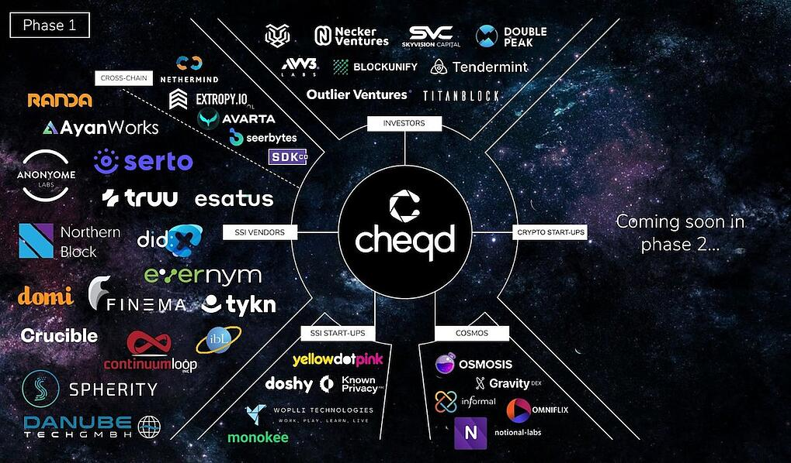

# v0.3.1

## Mainnet go-live [November 2021]

In November 2021, [we released the cheqd mainnet](https://blog.cheqd.io/weve-launched-a-token-incentivised-network-built-on-cosmos-for-self-sovereign-identity-5e611da132a5) with the support of our wide range of partners.

cheqd was always meant to be designed with decentralised identity at its core. As such, this release is where we implemented our foundational identity functionality.

### Changelog

* Added functionality for decentralised identity, specifically Decentralised Identifiers (DIDs), [utilising the new cheqd DID method](https://docs.cheqd.io/node/architecture/adr-list/adr-002-cheqd-did-method)
* Amended the genesis parameters
* Integration with [Keplr](https://keplr.app), [OmniFlix](https://cheqd.omniflix.co)

**Full changelog**: [cheqd-node v0.3.1 release notes](https://github.com/cheqd/cheqd-node/releases/tag/v0.3.1) on GitHub
