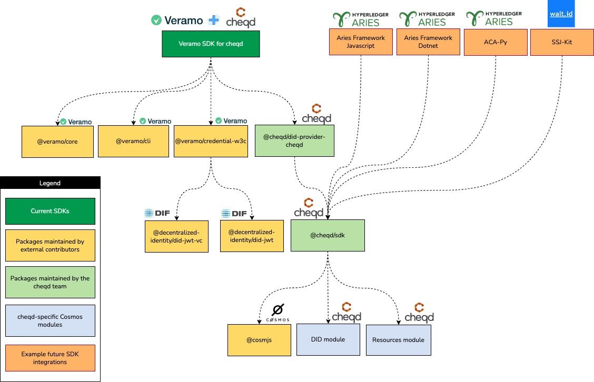

# 📦 Veramo SDK for cheqd

## Overview

[Veramo is a JavaScript Framework for Verifiable Data](https://veramo.io/). The[Veramo SDK](https://github.com/uport-project/veramo) is an agent designed to handle multiple networks and DID methods. Current implementations of the Veramo SDK include _did:ethr, did:web, did:key_ and more.

We chose Veramo for a few key reasons.

1. **Design Principles —** The Veramo SDK was designed to be highly flexible and modular making it highly scalable and fit for a lot of complex workflows. As a result, we felt it offered a route to minimise how much needs to be built from scratch. Through its flexible plug-in system, it’s easy to pick and choose which plug-ins are most beneficial, plus it’s possible to add in our custom packages where required which we knew would be necessary from Cosmos-based transactions.
2. **Developer Experience** — The Veramo SDK has been designed in a way that offers a fast end-to-end process. Ultimately, at cheqd, we want to reduce the amount of time our team spends on SDKs and so we can maintain our focus on building ledger functionality (i.e. building our implementation of the revocation registry and the credentials payment rails).
3. **Attractive & Simple CLI —** The Veramo core API is exposed by its CLI which makes it easy to create DIDs and VCs directly from a terminal or local cloud agent.
4. **Platform Agnostic** — The Veramo packages run on Node, Browsers and React & React Native right out of the box.

### Setting up Veramo SDK for cheqd

* [Setup guide on Veramo SDK for cheqd](https://docs.cheqd.io/identity/guides/software-development-kits-sdks/veramo-sdk-for-cheqd/setup-cli)

### What does the Veramo SDK for cheqd allow you to do on the cheqd network?

Veramo provides an excellent foundation for clients that want to build verifiable data applications. This is because Veramo Core, the Veramo CLI and any specific plugins are available as NPM packages, enabling:

1. Identity functionality to be carried out through a native CLI interface; or
2. Identity functionality to be integrated directly into client applications through NPM packages.

More importantly, Veramo is useful for both DIDs as well as Verifiable Credentials and Verifiable Presentations. It’s not just for one side of the credential usage process.

When combining the existing packages provided by the Veramo SDK with some native packages that we’ve built at cheqd the following functionality is available on the cheqd network _(hyperlinks go to the tutorial/information for each):_

* [Create and manage keys for **signing and encryption**](https://docs.cheqd.io/identity/building-decentralized-identity-apps/veramo-sdk-for-cheqd/did-operations/identity-key-handling)
* [Create and update **Decentralized Identifiers (DID)** and Decentralized Identifiers Documents (DID Docs) on cheqd (did:cheqd)](https://docs.cheqd.io/identity/building-decentralized-identity-apps/veramo-sdk-for-cheqd/did-operations)
* [**Issue JSON** Verifiable Credentials (VCs) with **JWT** proof format](https://docs.cheqd.io/identity/guides/software-development-kits-sdks/veramo-sdk-for-cheqd)
* [**Verify JSON** Verifiable Credentials (VCs) with **JWT** proof format](https://docs.cheqd.io/identity/guides/software-development-kits-sdks/veramo-sdk-for-cheqd/verify-jwt-vc)
* [**Issue JSON** Verifiable Presentations (VPs) with **JWT** proof format](https://docs.cheqd.io/identity/building-decentralized-identity-apps/veramo-sdk-for-cheqd/verifiable-presentations)
* [**Verify JSON** Verifiable Credentials (VPs) with **JWT** proof format](https://docs.cheqd.io/identity/building-decentralized-identity-apps/veramo-sdk-for-cheqd/verifiable-presentations/verify-presentation)

With the additional [**Resource module**](https://docs.cheqd.io/identity/tutorials/on-ledger-resources) recently applied to the cheqd ledger, AnonCreds will also be possible through the [cheqd/sdk](https://github.com/cheqd/sdk) which the Veramo SDK for cheqd uses.&#x20;

## Architecture

_Figure 1:_ Veramo SDK for cheqd architecture with components ([editable Draw.io version](https://github.com/cheqd/identity-docs/blob/main/.gitbook/assets/veramo-sdk-for-cheqd.drawio))

`did-provider-cheqd` consumes functionality that exists within the [`@cheqd/sdk` NPM package](https://www.npmjs.com/package/@cheqd/sdk) in a way that complies to the Veramo `AbstractIdentifierProvider`. (You don't need to call this package separately as it's already included as a dependency in `package.json`.)

This package works alongside other base Veramo packages:

* [`@veramo/core`](https://www.npmjs.com/package/@veramo/core)
* [`@veramo/cli`](https://www.npmjs.com/package/@veramo/cli)
* [`@veramo/credential-w3c`](https://www.npmjs.com/package/@veramo/credential-w3c)

The `@cheqd/sdk` package adds Cosmos SDK specific functionality such as signing transactions, paying for ledger fees, etc.

For identity-related keys, this plugin uses [Veramo's Key Management System (KMS)](https://www.npmjs.com/package/@veramo/key-manager) to manage keys for create and update operations.

Find out about [other Veramo plug-ins in their official documentation](https://veramo.io/docs/veramo_agent/plugins).
