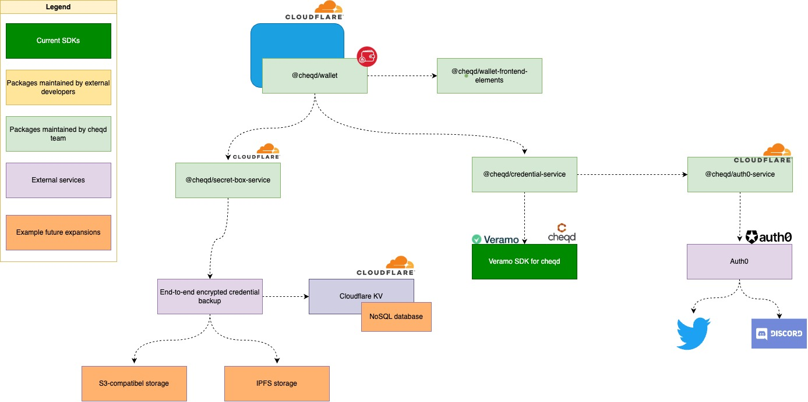

# 💳 Wallet

## Business Context

The cheqd webapp wallet offers an example implementation of how developers can leverage cheqd’s packages to create an identity application.

This was initially built for IIW 34 in April 2022. It has been since updated for IIW 35 in November 2022.

Features include:

* Store and share digital identity credentials.
* Share multiple digital identity credentials in one presentation
* Access your CHEQ wallet account by connecting to the [Keplr browser extension](https://keplr.app/).
* Send CHEQ tokens
* Delegate, undelegate and redelegate to validators

Our starting principle for this wallet example implementation was to build a non-custodial wallet, which works in a browser. This is because a lot of identity wallets are "custodial" (on browser, mobile, desktop), i.e., they rely on having a 3rd party hold / operate actual credential interactions.

Quite often, this is due to technical requirements on software libraries that can _only_ work on specific OSes. For example, many Aries frameworks rely on software libraries that are specifically compiled for iOS/Android/Linux/Windows/Mac.

Under the hood, we're doing something very similar to how password managers such as LastPass or 1Password work: only an encrypted copy of credentials is backed up. When you connect via Keplr, the backup is downloaded and decrypted only within your browser.

So what does this show? It shows a non-custodial wallet that can be recovered. Only the end-user, and whom they share it with, can see the contents. Obviously, this is only an example! An app developer could do a custodial wallet instead. Or, instead of using a Cosmos/Keplr wallet to authenticate an account, an app developer could use any other mechanism, such as username/password, SSO/OAuth etc.

To implement the credential issuance, we built this on top of [Veramo’s SDK](https://veramo.io), since we found it was highly modular.

## Architecture

_Figure: Architecture of demo wallet (_[_editable Draw.io source file_](../../.gitbook/assets/wallet-architecture.drawio)_)_

## Developer Guide

If you’re exploring implementing a similar approach, here’s what you should bear in mind, broken down by each key repo / NPM package involved.

### cheqd wallet

> 🛠️ **Github repository**: [cheqd/wallet](https://github.com/cheqd/wallet)

[cheqd Wallet](https://wallet.cheqd.io/) allows users to perform standard DeFi activities on Cosmos such as staking/delegating, voting on governance Proposals, and sending tokens. Crucially, the cheqd Wallet goes one step further than this, offering the ability to store and share [Verifiable Credentials](https://learn.cheqd.io/overview/introduction-to-decentralised-identity/what-is-a-verifiable-credential-vc).

### Wallet frontend

> 🛠️ **Github repository**: [cheqd/wallet-frontend-elements](https://github.com/cheqd/wallet-frontend-elements)

The [NPM package](https://www.npmjs.com/package/@cheqd/wallet-frontend-elements) provides reusable frontend elements to be used in [cheqd Wallet](https://github.com/cheqd/wallet). This repository was a forked version of the Cosmos based [Lum network wallet](https://wallet.lum.network/welcome) ([lum-network](https://github.com/lum-network)/[wallet](https://github.com/lum-network/wallet)).

### Credential storage

> 🛠️ **Github repository**: [cheqd/secret-box-service](https://github.com/cheqd/secret-box-service)

The purpose of this [NPM package](https://www.npmjs.com/package/@cheqd/secret-box-service) is to store credentials from the [wallet.cheqd.io](https://wallet.cheqd.io/) web app. As such the [wallet frontend](https://github.com/cheqd)needs to be paired with the [secret box service](https://github.com/cheqd/secret-box-service). This works by only storing an encrypted copy of the credentials which is decrypted within the browser based on the user (holder) entering a passphrase.

### Credential issuance and verification backend

> 🛠️ **Github repository**: [cheqd/credential-service](https://github.com/cheqd/credential-service)

The purpose of this service is to issue and verify credentials. This service by itself does not take care of storing the credentials. This service is also dependent on [auth0-service](https://github.com/cheqd/auth0-service). Previously [credential service](https://github.com/cheqd/credential-service) used a Cloudflare container however it’s now running in its own node container.

### User authentication with social media connection

> 🛠️ **Github repository**: [chqed/auth0-service](https://github.com/cheqd/auth0-service)

The purpose of this [NPM package](https://www.npmjs.com/package/@cheqd/auth0-service) is to provide an OAuth connection via the Auth0 service for credentials in [wallet.cheqd.io](https://wallet.cheqd.io/) web app.

This enables builders to offer users authentication with a Social Media account, e.g. Twitter and Discord, used in our demo.

### cheqd TypeScript SDK

> 🛠️ **Github repository**: [cheqd/sdk](https://github.com/cheqd/sdk)

The purpose of this [NPM package](https://www.npmjs.com/package/@cheqd/sdk) is to provide a mechanism of integrating cheqd functionality in an application _without_ using a 3rd-party SDK like [Veramo SDK for cheqd](https://docs.cheqd.io/identity/guides/sdk/veramo-sdk-for-cheqd).

This package includes:

* [TypeScript Protobuf definitions](https://github.com/cheqd/ts-proto) for custom cheqd Cosmos SDK modules
* [CosmJS](https://github.com/cosmos/cosmjs), for base Cosmos SDK module functions

If you are using [Veramo SDK for cheqd](https://docs.cheqd.io/identity/guides/sdk/veramo-sdk-for-cheqd), this SDK package is automatically installed and consumed by the [did-provider-cheqd Veramo plugin](https://github.com/cheqd/did-provider-cheqd).

### cheqd x Veramo plug-in

> 🛠️ **Github repository**: [cheqd/did-provider-cheqd](https://github.com/cheqd/did-provider-cheqd)

The purpose of this [NPM package](https://www.npmjs.com/package/@cheqd/did-provider-cheqd) is to enable developers to interact with the cheqd ledger using [Veramo SDK](https://veramo.io/), a modular and pluggable client app SDK for decentralised identity and SSI applications.

This package includes [Veramo SDK Agent methods](https://veramo.io/docs/veramo\_agent/plugins) for use with the [Veramo CLI NPM package](https://www.npmjs.com/package/@veramo/cli). It can also be consumed as an NPM package outside Veramo CLI for building your own applications with NPM.

The package's core functionality is borrowed from [Veramo Core NPM package](https://www.npmjs.com/package/@veramo/core). and extends this to include cheqd ledger functionality, such as creating and managing DIDs.

did-provider-cheqd is the first Veramo SDK plug-in that utilises the _DID Manager Update_ method to offer a full-body DIDDoc update for a DID on cheqd ledger, rather than individual field update transactions used more commonly in other DID methods such as [did:ethr](https://developer.uport.me/ethr-did/docs/index).

New DID creation can also be done by passing a full-body DIDoc payload in JSON, rather than having to assemble the document field-by-field.
